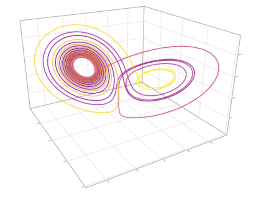

# ResComp.jl

A reservoir computing package for Julia, intended to integrate nicely with [SciML](https://github.com/sciml).

## Quick start

As an example, it is shown how to predict trajectories for a Lorenz attractor in autonomous mode. Training data is required in the form of a time-series. An `ODESolution` will do:
```julia
dt = 0.01
t = 100
prob = ODEProblem(lorenz!, [1.0, 0.0, 0.0], (0.0, 1000.0))
sol = solve(prob, dt=dt, adaptive=false)
uspin, utrain, ytrain = sol[1:t], sol[t+1:end-1], sol[t+2:end]
```
Then build the RC (an ESN in this case) from the training data:
```julia
rc = RC(200, u_train, y_train, uspin=uspin, method=RidgeRegression(1e-7))
```
For now, only `RidgeRegression` is available as training method, but you can implement your own. Then you can evolve it in time using `evolve!` and an appropriate integration algorithm. For now only `DiscreteDrive` and `DiscreteAuto` (to do a discrete map evolution) are implemented, but again, you can implement your own. As an example, given a spinup series `uspin`, the autonomous output can be obtained with:
```julia
evolve!(rc, DiscreteDrive(), driver=uspin)
y = evolve(rc, DiscreteAuto(), tspan=(0.0, 100.0), dt=dt, output=true)
```
The return type is a `RNNOutput`, a timeseries which will hold the solution if `save_ouput` was on, and a `RNNStates` timeseries if `save_states` was on.

## Make your own training method

Here is the interface:
```julia
struct CustomTrainMethod <: AbstractTrainMethod
    # your training internal variables
end

function train(c::CustomTrainMethod, r::RNNStates, y::AbstractVectorOfArray)
    # your training method
end
```

## Make your own integration algorithm

The integrator is an object containing all the necessary variables for a time step: the internal state `r`, the integration time `t`, etc. An algorithm usually employs a cache where it stores the additional variables it needs. If it needs more, you need a custom datatype (a struct). The cache is stored in the integrator. Here is the interface
```julia
struct CustomAlg <: AbstractDiscreteAlgorithm end

struct CustomAlgCache <: AbstractAlgorithmCache
    # your cache
end

function alg_stuff(::CustomAlg, rc; your_kwargs...)
    # set t_start, dt, n_steps and your cache
    t_start, dt, n_steps, cache
end

function perform_step!(int, rc, cache::DiscreteDriveCache)
    r = int.r
    h = int.h
    put_current!(h, r, rc.hidden)
    # your steps
    put_state!(r, h, rc.hidden)
    copyto!(int.r, r)
end
```

## Make your own RC

Declare your custom RC with custom layers
```julia
struct CustomLayer <: AbstractLayer
    # your layer internals
end

struct CustomRC{I, C, H, O} <: AbstractRC
    input::I
    custom::C
    hidden::H
    output::O
end
```
Then create a constructor for it and a custom integrator. If you want to use the standard integrator algorithms make sure it has `input`, `hidden` and `output`.